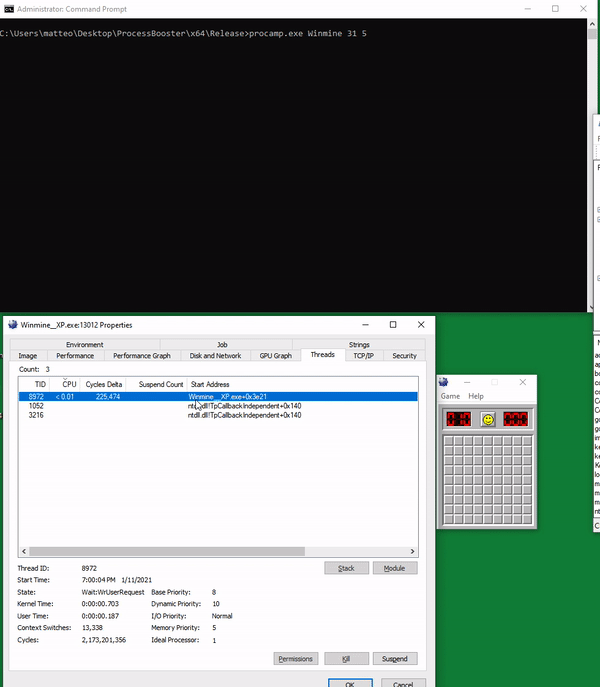

# ProcessAmp

A PoC driver inspired by the `Booster` from [Pavel Yosifovich](https://github.com/zodiacon) that rise each thread's priority on a given process.
The driver monitors newly created threads on an interval basis and assign them the desired priority, which eventually should improve performance.

Conversely, the driver can also be used to lower the priority on high-demand thread's thus, capping CPU utilization.

Note: the driver has not gone through [WHQL](https://docs.microsoft.com/en-us/windows-hardware/drivers/install/whql-release-signature) process, thus it requires enabling test-signing mode.

# Installation 

From elevated cmd

* Enable driver test signing mode and reboot to take effect

  `Bcdedit.exe -set TESTSIGNING ON`

* Install the driver

  `sc create processamp type= kernel binPath= c:\pathto\processamp.sys`

* Start the service

  `sc start processamp`

# Usage

##  Syntax
  
  `procamp.exe <target_process_name> <desired priority[0-31]> <refresh interval in seconds>`

## Example

Run the client against the target process to increase its threads to the maximum value (31) and refresh threads every five seconds.

  `procamp.exe minesweeper.exe 31 5`
  
  

**DISCLAIMER: the current version just works on unique process images that are mapped on a single PID**

